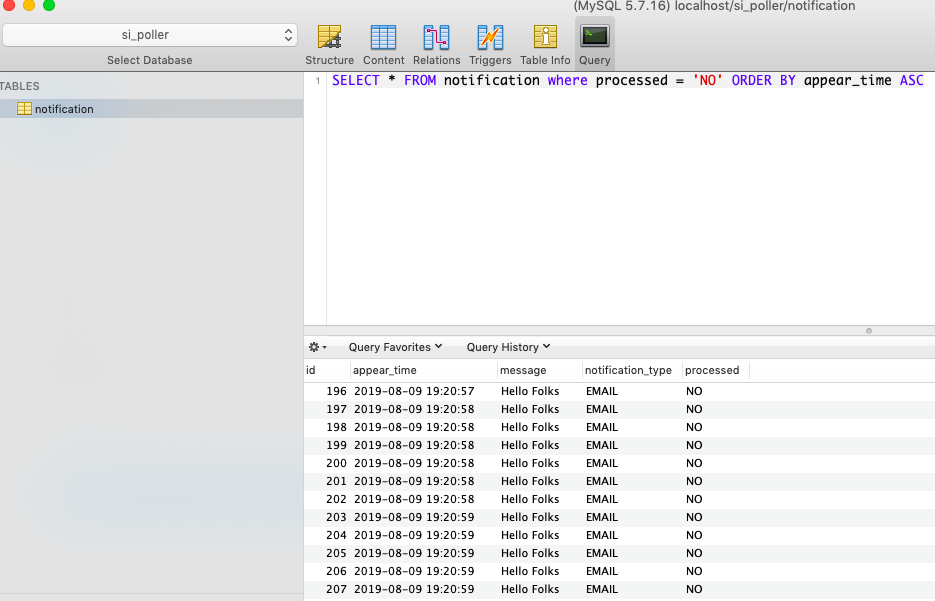
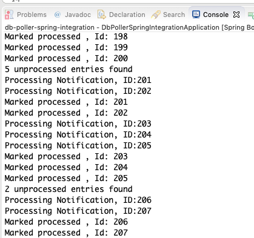

# spring-integration-boot-db-poller
Polling rows from db at predefined time interval and pass to custom message handlers using spring integration `JdbcPollingChannelAdapter`. 

```java
@Configuration
public class DbPoller {

	@Autowired
	NotificationMessageHandler notificationMessageHandler;
	
	@Autowired
	NotificationRowMapper notificationRowMapper;
	
	final String pollerQuery = "SELECT * FROM notification where processed = 'NO' ORDER BY appear_time ASC LIMIT 5";
	
	//Channel 'notificationChannel'
	@Bean
    public MessageChannel notificationChannel() {
        return new DirectChannel();
    }
	
	//InboundChannelAdapter (subscribe to notificationChannel and put messages to this channel)
	@Bean
	@InboundChannelAdapter(value = "notificationChannel", poller = @Poller(fixedDelay="5000"))//5 Seconds
	public MessageSource<?> notificationPoller(DataSource dataSource) {
		JdbcPollingChannelAdapter jdbcPollingChannelAdapter = new JdbcPollingChannelAdapter(dataSource, pollerQuery);
		jdbcPollingChannelAdapter.setRowMapper(notificationRowMapper);
		return jdbcPollingChannelAdapter;
	}
	
	//handling a message on notificationChannel
	@Bean
    @ServiceActivator(inputChannel= "notificationChannel")
    public MessageHandler dbMessageHandler() {
        return notificationMessageHandler;
    }
}
```

### DB


### Console output


### Usefull Links
[Enterprise Integration Patterns](https://www.enterpriseintegrationpatterns.com/patterns/messaging/toc.html)